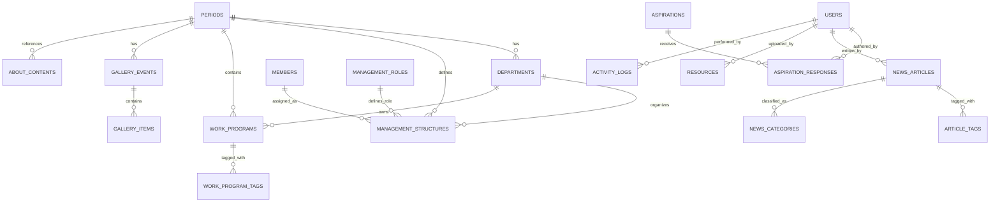

# HMDSI Web System — Complete Database Schema (ERD)

> **Database Engine:** MySQL 8.x  
> **Encoding:** utf8mb4_unicode_ci  
> **Soft Deletes:** Semua tabel utama menggunakan `deleted_at`  
> **Last Updated:** 2026-09-07

---

## Entity Relationship Diagram (ERD)



---

## Tabel 1: `periods` — Periode Kepengurusan

> Root tabel. Semua data organisasi terikat pada periode tertentu, memungkinkan website dipakai lintas kepengurusan tanpa menghapus data lama.

| Column | Type | Constraint | Default | Description |
|--------|------|------------|---------|-------------|
| `id` | `BIGINT UNSIGNED` | PK, AUTO_INCREMENT | — | Primary key |
| `name` | `VARCHAR(50)` | NOT NULL | — | Contoh: "2025/2026" |
| `start_date` | `DATE` | NOT NULL | — | Tanggal mulai periode |
| `end_date` | `DATE` | NOT NULL | — | Tanggal akhir periode |
| `is_active` | `BOOLEAN` | NOT NULL | `false` | Hanya 1 yang boleh aktif |
| `theme` | `VARCHAR(255)` | NULLABLE | — | Tema/motto periode |
| `created_at` | `TIMESTAMP` | — | `NOW()` | — |
| `updated_at` | `TIMESTAMP` | — | — | — |
| `deleted_at` | `TIMESTAMP` | NULLABLE | — | Soft delete |

**Indexes:** `is_active`, `name`  
**Business Rule:** Hanya satu `is_active = true` yang diperbolehkan (enforced via application logic / trigger).

---

## Tabel 2: `departments` — Departemen/Divisi

> Memetakan departemen per periode. Tiap periode bisa memiliki struktur departemen berbeda.

| Column | Type | Constraint | Default | Description |
|--------|------|------------|---------|-------------|
| `id` | `BIGINT UNSIGNED` | PK, AUTO_INCREMENT | — | Primary key |
| `period_id` | `BIGINT UNSIGNED` | FK → `periods.id` | — | Periode aktif |
| `name` | `VARCHAR(100)` | NOT NULL | — | Nama dept (Bahasa Indonesia) |
| `name_en` | `VARCHAR(100)` | NOT NULL | — | English name |
| `slug` | `VARCHAR(120)` | UNIQUE, NOT NULL | — | URL-friendly: "academic-research" |
| `type` | `ENUM('leader','core','department')` | NOT NULL | — | Klasifikasi hierarki |
| `description` | `TEXT` | NULLABLE | — | Deskripsi tugas departemen |
| `icon` | `VARCHAR(50)` | NULLABLE | — | Nama ikon Lucide (opsional) |
| `sort_order` | `TINYINT UNSIGNED` | DEFAULT `0` | — | Urutan tampil di orgchart |
| `created_at` | `TIMESTAMP` | — | `NOW()` | — |
| `updated_at` | `TIMESTAMP` | — | — | — |
| `deleted_at` | `TIMESTAMP` | NULLABLE | — | Soft delete |

**Indexes:** `period_id`, `slug`, `type`  
**Foreign Key:** `departments_period_id_foreign` → `periods(id)` ON DELETE CASCADE

---

## Tabel 3: `members` — Data Anggota/Pengurus

> Master data personal. Satu orang bisa menjadi pengurus di beberapa periode berbeda tanpa duplikasi data personal.

| Column | Type | Constraint | Default | Description |
|--------|------|------------|---------|-------------|
| `id` | `BIGINT UNSIGNED` | PK, AUTO_INCREMENT | — | Primary key |
| `full_name` | `VARCHAR(150)` | NOT NULL | — | Nama lengkap |
| `student_id` | `VARCHAR(20)` | UNIQUE, NOT NULL | — | NIM (Nomor Induk Mahasiswa) |
| `study_program` | `VARCHAR(100)` | NOT NULL | — | Program studi |
| `batch_year` | `YEAR` | NOT NULL | — | Angkatan (e.g., 2023) |
| `email` | `VARCHAR(150)` | NULLABLE | — | Email kampus/pribadi |
| `phone` | `VARCHAR(20)` | NULLABLE | — | Nomor telepon |
| `photo_url` | `VARCHAR(500)` | NULLABLE | — | URL foto (Cloudinary) |
| `linkedin_url` | `VARCHAR(255)` | NULLABLE | — | Profil LinkedIn |
| `instagram_handle` | `VARCHAR(50)` | NULLABLE | — | @username Instagram |
| `bio` | `TEXT` | NULLABLE | — | Bio singkat |
| `created_at` | `TIMESTAMP` | — | `NOW()` | — |
| `updated_at` | `TIMESTAMP` | — | — | — |
| `deleted_at` | `TIMESTAMP` | NULLABLE | — | Soft delete |

**Indexes:** `student_id`, `batch_year`  
**Note:** `student_id` UNIQUE memastikan 1 NIM = 1 data anggota

---

## Tabel 4: `management_roles` — Jabatan/Role

> Lookup table untuk jabatan. Memisahkan jabatan dari data member agar bisa di-reuse antar periode.

| Column | Type | Constraint | Default | Description |
|--------|------|------------|---------|-------------|
| `id` | `BIGINT UNSIGNED` | PK, AUTO_INCREMENT | — | Primary key |
| `name` | `VARCHAR(100)` | NOT NULL | — | Nama jabatan: "Kepala Departemen" |
| `name_en` | `VARCHAR(100)` | NOT NULL | — | "Department Head" |
| `level` | `TINYINT UNSIGNED` | NOT NULL | — | Hierarki (1=Ketua, 2=Wakil, dst.) |
| `created_at` | `TIMESTAMP` | — | `NOW()` | — |

**Indexes:** `level`  
**Seed Data:** Ketua (1), Wakil Ketua (2), Sekretaris Jenderal (3), dll.

---

## Tabel 5: `management_structures` — Struktur Kepengurusan *(Pivot Utama)*

> Tabel pivot yang menghubungkan Member + Department + Role + Period. Ini adalah jantung dari fitur Org Chart.

| Column | Type | Constraint | Default | Description |
|--------|------|------------|---------|-------------|
| `id` | `BIGINT UNSIGNED` | PK, AUTO_INCREMENT | — | Primary key |
| `period_id` | `BIGINT UNSIGNED` | FK → `periods.id` | — | Periode kepengurusan |
| `member_id` | `BIGINT UNSIGNED` | FK → `members.id` | — | Anggota yang menjabat |
| `department_id` | `BIGINT UNSIGNED` | FK → `departments.id` | — | Departemen terkait |
| `role_id` | `BIGINT UNSIGNED` | FK → `management_roles.id` | — | Jabatan yang diemban |
| `is_active` | `BOOLEAN` | DEFAULT `true` | — | Flag keaktifan |
| `joined_at` | `DATE` | NULLABLE | — | Tanggal mulai menjabat |
| `ended_at` | `DATE` | NULLABLE | — | Tanggal selesai (jika demisioner awal) |
| `created_at` | `TIMESTAMP` | — | `NOW()` | — |
| `updated_at` | `TIMESTAMP` | — | — | — |
| `deleted_at` | `TIMESTAMP` | NULLABLE | — | Soft delete |

**Composite Unique:** `(period_id, member_id, department_id, role_id)`  
**Indexes:** `period_id`, `department_id`, `member_id`  
**Foreign Keys:**
- `management_structures_period_id_foreign` → `periods(id)` ON DELETE CASCADE
- `management_structures_member_id_foreign` → `members(id)` ON DELETE CASCADE
- `management_structures_department_id_foreign` → `departments(id)` ON DELETE CASCADE
- `management_structures_role_id_foreign` → `management_roles(id)` ON DELETE RESTRICT

---

## Tabel 6: `work_programs` — Program Kerja

> Menyimpan data proker per departemen dengan tracking status dan timeline.

| Column | Type | Constraint | Default | Description |
|--------|------|------------|---------|-------------|
| `id` | `BIGINT UNSIGNED` | PK, AUTO_INCREMENT | — | Primary key |
| `period_id` | `BIGINT UNSIGNED` | FK → `periods.id` | — | Periode proker |
| `department_id` | `BIGINT UNSIGNED` | FK → `departments.id` | — | Pemilik proker |
| `name` | `VARCHAR(200)` | NOT NULL | — | Nama program kerja |
| `slug` | `VARCHAR(220)` | UNIQUE, NOT NULL | — | URL-friendly |
| `description` | `TEXT` | NULLABLE | — | Deskripsi lengkap proker |
| `objectives` | `TEXT` | NULLABLE | — | Tujuan dan target proker |
| `status` | `ENUM('planned','in_progress','completed','postponed','cancelled')` | NOT NULL | `planned` | Status tracking |
| `planned_date` | `DATE` | NULLABLE | — | Tanggal rencana pelaksanaan |
| `actual_date` | `DATE` | NULLABLE | — | Tanggal realisasi |
| `planned_end_date` | `DATE` | NULLABLE | — | Estimasi selesai |
| `actual_end_date` | `DATE` | NULLABLE | — | Realisasi selesai |
| `budget_allocation` | `DECIMAL(12,2)` | NULLABLE | — | Anggaran yang dialokasikan |
| `budget_used` | `DECIMAL(12,2)` | NULLABLE | — | Anggaran yang terpakai |
| `participant_count` | `INT UNSIGNED` | DEFAULT `0` | — | Jumlah peserta |
| `cover_image_url` | `VARCHAR(500)` | NULLABLE | — | Thumbnail proker (Cloudinary) |
| `is_highlight` | `BOOLEAN` | DEFAULT `false` | — | Tampil di homepage highlight |
| `sort_order` | `SMALLINT UNSIGNED` | DEFAULT `0` | — | Urutan tampil |
| `created_at` | `TIMESTAMP` | — | `NOW()` | — |
| `updated_at` | `TIMESTAMP` | — | — | — |
| `deleted_at` | `TIMESTAMP` | NULLABLE | — | Soft delete |

**Indexes:** `period_id`, `department_id`, `status`, `is_highlight`, `slug`  
**Foreign Keys:**
- `work_programs_period_id_foreign` → `periods(id)` ON DELETE CASCADE
- `work_programs_department_id_foreign` → `departments(id)` ON DELETE CASCADE

---

## Tabel 7: `work_program_tags` — Tag Program Kerja

| Column | Type | Constraint | Default | Description |
|--------|------|------------|---------|-------------|
| `id` | `BIGINT UNSIGNED` | PK, AUTO_INCREMENT | — | Primary key |
| `work_program_id` | `BIGINT UNSIGNED` | FK → `work_programs.id` | — | Proker yang di-tag |
| `tag` | `VARCHAR(50)` | NOT NULL | — | Label tag (e.g., "lomba", "webinar") |

**Indexes:** `work_program_id`, `tag`  
**Foreign Key:** `work_program_tags_work_program_id_foreign` → `work_programs(id)` ON DELETE CASCADE

---

## Tabel 8: `aspirations` — Kotak Aspirasi

> Menyimpan aspirasi/feedback dari mahasiswa. Mendukung mode anonim.

| Column | Type | Constraint | Default | Description |
|--------|------|------------|---------|-------------|
| `id` | `BIGINT UNSIGNED` | PK, AUTO_INCREMENT | — | Primary key |
| `tracking_code` | `VARCHAR(20)` | UNIQUE, NOT NULL | — | Kode unik untuk cek status (e.g., "ASP-2026-XXXX") |
| `category` | `ENUM('academic','facility','internal','general','other')` | NOT NULL | — | Kategori aspirasi |
| `subject` | `VARCHAR(200)` | NOT NULL | — | Judul/subjek |
| `message` | `TEXT` | NOT NULL | — | Isi aspirasi |
| `status` | `ENUM('submitted','under_review','in_progress','resolved','rejected')` | DEFAULT `submitted` | — | Status penanganan |
| `is_anonymous` | `BOOLEAN` | DEFAULT `false` | — | Mode anonim |
| `sender_name` | `VARCHAR(100)` | NULLABLE | — | Nama pengirim (jika tidak anonim) |
| `sender_email` | `VARCHAR(150)` | NULLABLE | — | Email pengirim (jika tidak anonim) |
| `sender_student_id` | `VARCHAR(20)` | NULLABLE | — | NIM (opsional, untuk verifikasi mahasiswa) |
| `is_public` | `BOOLEAN` | DEFAULT `false` | — | Tampil di public tracker atau tidak |
| `resolved_at` | `TIMESTAMP` | NULLABLE | — | Waktu diselesaikan |
| `created_at` | `TIMESTAMP` | — | `NOW()` | — |
| `updated_at` | `TIMESTAMP` | — | — | — |

**Indexes:** `tracking_code`, `category`, `status`  
**Note:** `tracking_code` di-generate otomatis oleh backend (format: `ASP-YYYY-XXXXX`). Pengirim bisa cek status aspirasi tanpa perlu login, cukup dengan kode ini.

---

## Tabel 9: `aspiration_responses` — Balasan Aspirasi

> Admin bisa membalas/merespons aspirasi yang masuk.

| Column | Type | Constraint | Default | Description |
|--------|------|------------|---------|-------------|
| `id` | `BIGINT UNSIGNED` | PK, AUTO_INCREMENT | — | Primary key |
| `aspiration_id` | `BIGINT UNSIGNED` | FK → `aspirations.id` | — | Aspirasi yang direspons |
| `responded_by` | `BIGINT UNSIGNED` | FK → `users.id` | — | Admin yang merespons |
| `message` | `TEXT` | NOT NULL | — | Isi balasan |
| `is_public` | `BOOLEAN` | DEFAULT `false` | — | Tampil ke pengirim/publik |
| `created_at` | `TIMESTAMP` | — | `NOW()` | — |

**Indexes:** `aspiration_id`, `responded_by`  
**Foreign Keys:**
- `aspiration_responses_aspiration_id_foreign` → `aspirations(id)` ON DELETE CASCADE
- `aspiration_responses_responded_by_foreign` → `users(id)` ON DELETE RESTRICT

---

## Tabel 10: `news_articles` — Berita & Artikel

> Pusat informasi dan press release kegiatan/akademik.

| Column | Type | Constraint | Default | Description |
|--------|------|------------|---------|-------------|
| `id` | `BIGINT UNSIGNED` | PK, AUTO_INCREMENT | — | Primary key |
| `author_id` | `BIGINT UNSIGNED` | FK → `users.id` | — | Penulis (admin) |
| `title` | `VARCHAR(255)` | NOT NULL | — | Judul artikel |
| `slug` | `VARCHAR(280)` | UNIQUE, NOT NULL | — | URL-friendly |
| `excerpt` | `VARCHAR(500)` | NULLABLE | — | Ringkasan singkat |
| `content` | `LONGTEXT` | NOT NULL | — | Isi artikel (HTML/Markdown) |
| `cover_image_url` | `VARCHAR(500)` | NULLABLE | — | Foto sampul (Cloudinary) |
| `category` | `ENUM('news','announcement','achievement','academic','event')` | NOT NULL | — | Jenis konten |
| `status` | `ENUM('draft','published','archived')` | DEFAULT `draft` | — | Status publikasi |
| `is_featured` | `BOOLEAN` | DEFAULT `false` | — | Tampil di headline/homepage |
| `view_count` | `INT UNSIGNED` | DEFAULT `0` | — | Jumlah views |
| `published_at` | `TIMESTAMP` | NULLABLE | — | Waktu dipublikasi |
| `created_at` | `TIMESTAMP` | — | `NOW()` | — |
| `updated_at` | `TIMESTAMP` | — | — | — |
| `deleted_at` | `TIMESTAMP` | NULLABLE | — | Soft delete |

**Indexes:** `slug`, `category`, `status`, `is_featured`, `published_at`  
**Foreign Key:** `news_articles_author_id_foreign` → `users(id)` ON DELETE RESTRICT

---

## Tabel 11: `article_tags` — Tag Artikel

| Column | Type | Constraint | Default | Description |
|--------|------|------------|---------|-------------|
| `id` | `BIGINT UNSIGNED` | PK, AUTO_INCREMENT | — | Primary key |
| `news_article_id` | `BIGINT UNSIGNED` | FK → `news_articles.id` | — | Artikel |
| `tag` | `VARCHAR(50)` | NOT NULL | — | Label tag |

**Indexes:** `news_article_id`, `tag`  
**Foreign Key:** `article_tags_news_article_id_foreign` → `news_articles(id)` ON DELETE CASCADE

---

## Tabel 12: `gallery_events` — Event Galeri

> Mengelompokkan foto/media berdasarkan event/kegiatan.

| Column | Type | Constraint | Default | Description |
|--------|------|------------|---------|-------------|
| `id` | `BIGINT UNSIGNED` | PK, AUTO_INCREMENT | — | Primary key |
| `period_id` | `BIGINT UNSIGNED` | FK → `periods.id` | NULLABLE | Periode terkait |
| `title` | `VARCHAR(200)` | NOT NULL | — | Nama event |
| `slug` | `VARCHAR(220)` | UNIQUE, NOT NULL | — | URL-friendly |
| `description` | `TEXT` | NULLABLE | — | Keterangan event |
| `event_date` | `DATE` | NULLABLE | — | Tanggal event berlangsung |
| `cover_image_url` | `VARCHAR(500)` | NULLABLE | — | Cover album (otomatis dari item pertama jika null) |
| `is_published` | `BOOLEAN` | DEFAULT `false` | — | Tampil ke publik |
| `sort_order` | `SMALLINT UNSIGNED` | DEFAULT `0` | — | Urutan galeri |
| `created_at` | `TIMESTAMP` | — | `NOW()` | — |
| `updated_at` | `TIMESTAMP` | — | — | — |
| `deleted_at` | `TIMESTAMP` | NULLABLE | — | Soft delete |

**Indexes:** `period_id`, `slug`, `is_published`, `event_date`  
**Foreign Key:** `gallery_events_period_id_foreign` → `periods(id)` ON DELETE SET NULL

---

## Tabel 13: `gallery_items` — Item Galeri (Foto/Video)

| Column | Type | Constraint | Default | Description |
|--------|------|------------|---------|-------------|
| `id` | `BIGINT UNSIGNED` | PK, AUTO_INCREMENT | — | Primary key |
| `gallery_event_id` | `BIGINT UNSIGNED` | FK → `gallery_events.id` | — | Album terkait |
| `file_url` | `VARCHAR(500)` | NOT NULL | — | URL media (Cloudinary) |
| `thumbnail_url` | `VARCHAR(500)` | NULLABLE | — | Thumbnail kecil (Cloudinary transform) |
| `type` | `ENUM('photo','video')` | NOT NULL | `photo` | Jenis media |
| `caption` | `VARCHAR(300)` | NULLABLE | — | Keterangan foto |
| `cloudinary_public_id` | `VARCHAR(200)` | NULLABLE | — | ID asset di Cloudinary (untuk delete) |
| `sort_order` | `SMALLINT UNSIGNED` | DEFAULT `0` | — | Urutan tampil |
| `created_at` | `TIMESTAMP` | — | `NOW()` | — |

**Indexes:** `gallery_event_id`, `type`, `sort_order`  
**Foreign Key:** `gallery_items_gallery_event_id_foreign` → `gallery_events(id)` ON DELETE CASCADE

---

## Tabel 14: `resources` — Pusat Sumber Daya & Arsip

> Download center untuk silabus, bank soal, modul, dan template dokumen.

| Column | Type | Constraint | Default | Description |
|--------|------|------------|---------|-------------|
| `id` | `BIGINT UNSIGNED` | PK, AUTO_INCREMENT | — | Primary key |
| `title` | `VARCHAR(200)` | NOT NULL | — | Judul dokumen |
| `description` | `TEXT` | NULLABLE | — | Keterangan singkat |
| `category` | `ENUM('syllabus','exam_bank','module','org_template','other')` | NOT NULL | — | Kategori dokumen |
| `file_url` | `VARCHAR(500)` | NOT NULL | — | URL file (Cloudinary/Drive) |
| `file_type` | `VARCHAR(10)` | NULLABLE | — | "pdf", "docx", "pptx" |
| `file_size_kb` | `INT UNSIGNED` | NULLABLE | — | Ukuran file dalam KB |
| `academic_year` | `VARCHAR(10)` | NULLABLE | — | Tahun ajaran: "2025/2026" |
| `semester` | `TINYINT UNSIGNED` | NULLABLE | — | 1 atau 2 |
| `subject` | `VARCHAR(100)` | NULLABLE | — | Mata kuliah terkait |
| `download_count` | `INT UNSIGNED` | DEFAULT `0` | — | Jumlah unduhan |
| `is_published` | `BOOLEAN` | DEFAULT `true` | — | Tampil ke publik |
| `uploaded_by` | `BIGINT UNSIGNED` | FK → `users.id` | — | Admin yang upload |
| `created_at` | `TIMESTAMP` | — | `NOW()` | — |
| `updated_at` | `TIMESTAMP` | — | — | — |
| `deleted_at` | `TIMESTAMP` | NULLABLE | — | Soft delete |

**Indexes:** `category`, `academic_year`, `is_published`, `uploaded_by`  
**Foreign Key:** `resources_uploaded_by_foreign` → `users(id)` ON DELETE RESTRICT

---

## Tabel 15: `about_contents` — Konten Halaman About Us

> Single-row editable content untuk halaman About. Gunakan pattern `upsert` saat update.

| Column | Type | Constraint | Default | Description |
|--------|------|------------|---------|-------------|
| `id` | `BIGINT UNSIGNED` | PK, AUTO_INCREMENT | — | Primary key |
| `period_id` | `BIGINT UNSIGNED` | FK → `periods.id` | NULLABLE | Periode aktif (nullable untuk legacy) |
| `organization_history` | `LONGTEXT` | NULLABLE | — | Narasi sejarah (HTML) |
| `vision` | `TEXT` | NULLABLE | — | Pernyataan Visi |
| `mission` | `JSON` | NULLABLE | — | Array string poin-poin misi |
| `values` | `JSON` | NULLABLE | — | Array `{title, description}` nilai organisasi |
| `logo_url` | `VARCHAR(500)` | NULLABLE | — | Logo HMDSI |
| `logo_description` | `TEXT` | NULLABLE | — | Makna logo/lambang |
| `is_active` | `BOOLEAN` | DEFAULT `true` | — | Versi aktif |
| `created_at` | `TIMESTAMP` | — | `NOW()` | — |
| `updated_at` | `TIMESTAMP` | — | — | — |

**Indexes:** `period_id`, `is_active`  
**Foreign Key:** `about_contents_period_id_foreign` → `periods(id)` ON DELETE SET NULL

---

## Tabel 16: `site_stats` — Statistik Website (Homepage Quick Stats)

> Key-value store untuk data statistik yang tampil di homepage (misal: "Total Anggota: 120").

| Column | Type | Constraint | Default | Description |
|--------|------|------------|---------|-------------|
| `id` | `BIGINT UNSIGNED` | PK, AUTO_INCREMENT | — | Primary key |
| `key` | `VARCHAR(50)` | UNIQUE, NOT NULL | — | Identifier: "total_members", "total_programs" |
| `label` | `VARCHAR(100)` | NOT NULL | — | Label tampil: "Total Anggota" |
| `value` | `VARCHAR(50)` | NOT NULL | — | Nilai: "120+", "15" |
| `icon` | `VARCHAR(50)` | NULLABLE | — | Nama ikon Lucide |
| `sort_order` | `TINYINT UNSIGNED` | DEFAULT `0` | — | Urutan tampil |
| `updated_at` | `TIMESTAMP` | — | — | — |

**Indexes:** `key`  
**Note:** Stat bisa di-compute otomatis via Laravel Console Command/Scheduler, atau diinput manual oleh admin.

---

## Tabel 17: `users` — Admin & Pengelola Konten

> Akun internal untuk admin panel. Bukan akun mahasiswa/anggota.

| Column | Type | Constraint | Default | Description |
|--------|------|------------|---------|-------------|
| `id` | `BIGINT UNSIGNED` | PK, AUTO_INCREMENT | — | Primary key |
| `name` | `VARCHAR(100)` | NOT NULL | — | Nama admin |
| `email` | `VARCHAR(150)` | UNIQUE, NOT NULL | — | Email login |
| `password` | `VARCHAR(255)` | NOT NULL | — | Bcrypt hash |
| `role` | `ENUM('super_admin','admin','editor')` | DEFAULT `editor` | — | Level akses |
| `avatar_url` | `VARCHAR(500)` | NULLABLE | — | Foto profil admin |
| `last_login_at` | `TIMESTAMP` | NULLABLE | — | Waktu login terakhir |
| `remember_token` | `VARCHAR(100)` | NULLABLE | — | Laravel remember token |
| `created_at` | `TIMESTAMP` | — | `NOW()` | — |
| `updated_at` | `TIMESTAMP` | — | — | — |
| `deleted_at` | `TIMESTAMP` | NULLABLE | — | Soft delete |

**Indexes:** `email`, `role`  
**Note:** Tabel `users` digunakan eksklusif untuk admin panel (Laravel Sanctum). Mahasiswa/anggota **tidak** perlu akun — aspirasi dikirim tanpa login, status dicek via `tracking_code`.

---

## Tabel 18: `news_categories` — Kategori Berita (Tambahan)

> Lookup table untuk kategori berita agar sistem tagging lebih fleksibel.

| Column | Type | Constraint | Default | Description |
|--------|------|------------|---------|-------------|
| `id` | `BIGINT UNSIGNED` | PK, AUTO_INCREMENT | — | Primary key |
| `name` | `VARCHAR(100)` | NOT NULL | — | Nama kategori: "Akademik" |
| `slug` | `VARCHAR(120)` | UNIQUE, NOT NULL | — | URL-friendly |
| `color` | `VARCHAR(7)` | NULLABLE | — | Kode hex warna tag |
| `description` | `TEXT` | NULLABLE | — | Deskripsi kategori |
| `created_at` | `TIMESTAMP` | — | `NOW()` | — |
| `updated_at` | `TIMESTAMP` | — | — | — |

**Indexes:** `slug`

---

## Tabel 19: `news_category_article` — Pivot Kategori-Artikel (Many-to-Many)

> Memungkinkan satu artikel memiliki banyak kategori (misal: "Akademik" + "Prestasi").

| Column | Type | Constraint | Default | Description |
|--------|------|------------|---------|-------------|
| `id` | `BIGINT UNSIGNED` | PK, AUTO_INCREMENT | — | Primary key |
| `news_article_id` | `BIGINT UNSIGNED` | FK → `news_articles.id` | — | Artikel |
| `news_category_id` | `BIGINT UNSIGNED` | FK → `news_categories.id` | — | Kategori |

**Composite Unique:** `(news_article_id, news_category_id)`  
**Foreign Keys:**
- `news_category_article_article_id_foreign` → `news_articles(id)` ON DELETE CASCADE
- `news_category_article_category_id_foreign` → `news_categories(id)` ON DELETE CASCADE

---

## Tabel 20: `activity_logs` — Audit Trail Admin

> Mencatat semua aksi admin untuk keperluan audit dan accountability.

| Column | Type | Constraint | Default | Description |
|--------|------|------------|---------|-------------|
| `id` | `BIGINT UNSIGNED` | PK, AUTO_INCREMENT | — | Primary key |
| `user_id` | `BIGINT UNSIGNED` | FK → `users.id` | — | Admin yang melakukan aksi |
| `action` | `VARCHAR(50)` | NOT NULL | — | Aksi: "create", "update", "delete", "publish", "respond" |
| `entity_type` | `VARCHAR(50)` | NOT NULL | — | Tabel entitas: "news_articles", "work_programs", dll. |
| `entity_id` | `BIGINT UNSIGNED` | NOT NULL | — | ID entitas yang diubah |
| `old_values` | `JSON` | NULLABLE | — | Data lama (sebelum diubah) |
| `new_values` | `JSON` | NULLABLE | — | Data baru (sesudah diubah) |
| `ip_address` | `VARCHAR(45)` | NULLABLE | — | IP address admin |
| `created_at` | `TIMESTAMP` | — | `NOW()` | — |

**Indexes:** `user_id`, `entity_type`, `entity_id`, `action`  
**Foreign Key:** `activity_logs_user_id_foreign` → `users(id`) ON DELETE CASCADE

---

## Relasi Lengkap (Summary)

```
periods (1) ──────< departments (N)
periods (1) ──────< management_structures (N)
periods (1) ──────< work_programs (N)
periods (1) ──────< gallery_events (N)
periods (1) ──────< about_contents (N)

departments (1) ──< management_structures (N)
departments (1) ──< work_programs (N)

members (1) ──────< management_structures (N)
management_roles (1) < management_structures (N)

work_programs (1) < work_program_tags (N)

aspirations (1) ──< aspiration_responses (N)
users (1) ─────── aspiration_responses (N)

news_articles (1) < article_tags (N)
users (1) ────────< news_articles (N)
users (1) ────────< resources (N)

gallery_events (1) < gallery_items (N)

news_categories (1) < news_category_article (N)
news_articles (1) < news_category_article (N)

users (1) ─────────< activity_logs (N)
```

---

## Pertimbangan Desain Kritis

### 1. Multi-Periode by Design
Semua data organisasi (departments, members, work_programs) terikat ke `period_id`. Query frontend default akan selalu memfilter berdasarkan periode aktif (`is_active = true`).

### 2. MySQL vs MongoDB
Dipilih **MySQL** karena:
- Data sangat terstruktur dan relasional (member ↔ role ↔ department ↔ period)
- Laravel Eloquent + MySQL sangat mature dan mudah di-maintain lintas developer
- Cloud options: **Aiven MySQL** (free tier cukup, EU region) atau **Railway MySQL**

### 3. Cloudinary untuk Media
Semua URL file disimpan sebagai `VARCHAR(500)` string. Keuntungan:
- Server backend tidak menyimpan file — lebih ringan
- Cloudinary mendukung transformasi otomatis (resize, format WebP, lazy load)
- Simpan `cloudinary_public_id` untuk keperluan delete via API

### 4. Soft Deletes Strategy
Tabel dengan soft delete: `departments`, `members`, `management_structures`, `work_programs`, `news_articles`, `gallery_events`, `resources`, `users`.  
**Tidak** perlu soft delete: `work_program_tags`, `article_tags`, `gallery_items`, `aspiration_responses`, `site_stats`, `management_roles`.

### 5. Tambahan: `news_categories` & `activity_logs`
- `news_categories` + pivot `news_category_article` memungkinkan tagging multi-kategori (lebih fleksibel dari single ENUM)
- `activity_logs` penting untuk audit trail admin — siapa mengubah apa, kapan, dan nilai sebelum/sesudah

---

*Skema ini siap dikonversi ke Laravel Migration Files (20 tabel).*
